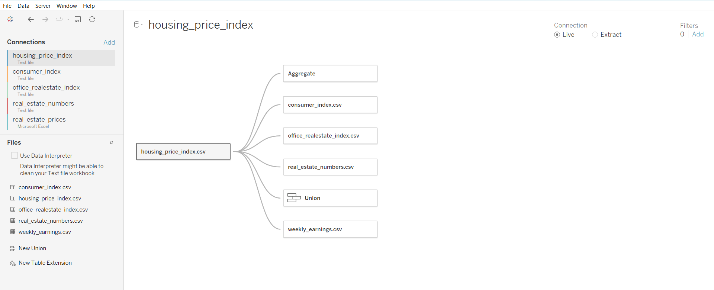
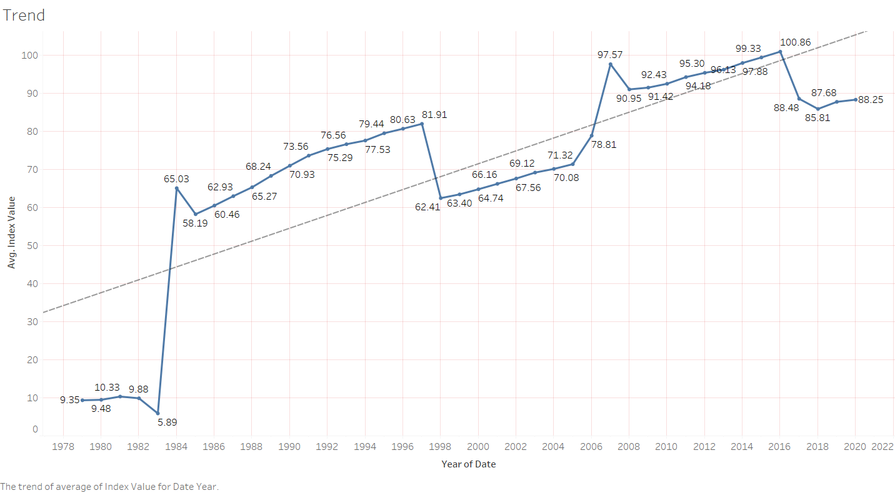
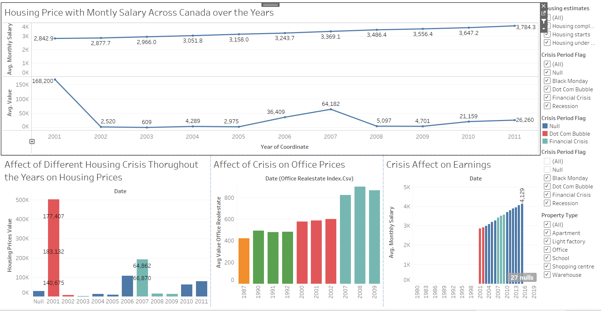

# Final-Project-Tableau

## Project/Goals

In this We are working with Housing Data from Canadian Open Data Portal:

- Weekly earnings from 1.1.2001 to 15.4.2015 (weekly_earnings - CSV)
- Housing constructions from 1955 to 2019 (real_estate_numbers - CSV)
- House prices from 1.1.2005 to 1.9.2020 (real_estate_prices - EXCEL)
- Housing_price_index from November 1979 to September 2020
- Office_realestate_index from November 1979 to September 2020
- Consumer index from November 1979 to September 2020

We are Working with Tablea to Create Visualizations and performaing EDA.

## Process
### Step 1

- Creating Relationships between different Data Tables in Tableau to use it for creating Visualization and dashboards

### Creating Different Worksheets and Dashboard for EDA and Creating Visualization 

## Results

#### Working with Option 1 

###### Showing Trend For Housing Index Values in last 40 Years

###### Checking Price Differences between Districts

We have created a Bar Chart to check price difference between different districts in Canada over the Years fo Different House Prices

There is no relative difference between house prices between districts

###### Comparing Monthly Income with Housing Prices over the Years

We have seen that monthly Income has increased Steadily throughout the Years

House Prices have been Fluctuating over the years caused by different Financial Crisis over the years

###### Relation Between Consumer Index and Housing Price Index

Created a Regression Model to find the realtion between Consumer Index and Housing Price Index

As per Model: There is Negative coorrelation between Both variables

As Housing Price Index increases the Consumer Index decreases

###### Housing Crisis over the Years

I have showed the effect of different Housing and Financial Crisis over the years on different factors

Earnings 
Housing Prices 
Office Prices

## Challenges 

Data not enough.
Issues with creating relations 
Saving work frequently in Tabelau to not lose work

## Future Goals

Gather more data to work with 
